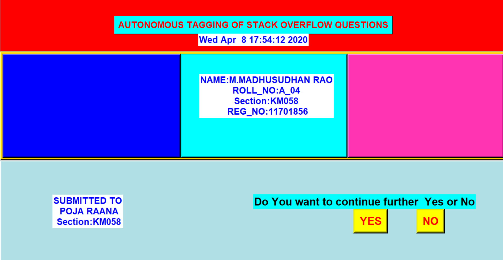
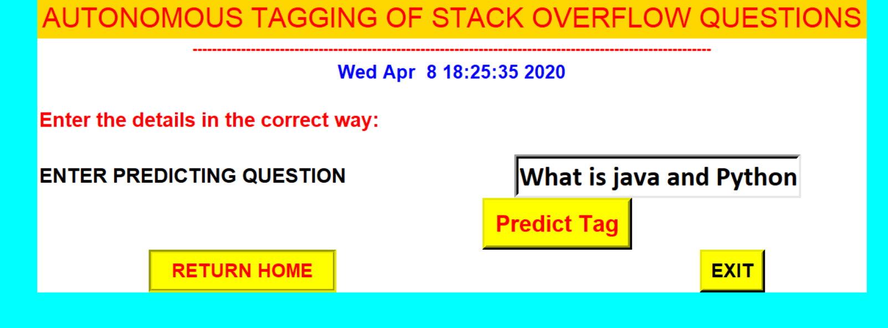
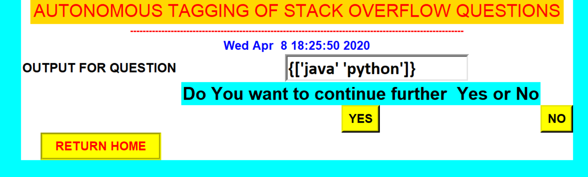

# Autonomous_Tagging_Of_Stack_Overflow_Questions
In this project we are able to automatically assign tags to the questions from StackOverflow questions.
For this we try to generate a most suitable and probable method i.e Multi-label Classification to predict tags for given questions.
We implemnt a several classifiers. But, out of all One-vs-rest classifier is best suitable to predict tags.

#FRONT_PAGE

#Asking_Tag_Page

#PREDICT_TAG

